Wifi Power Strip
================

Software:
---------

C++ source

Screenshots:

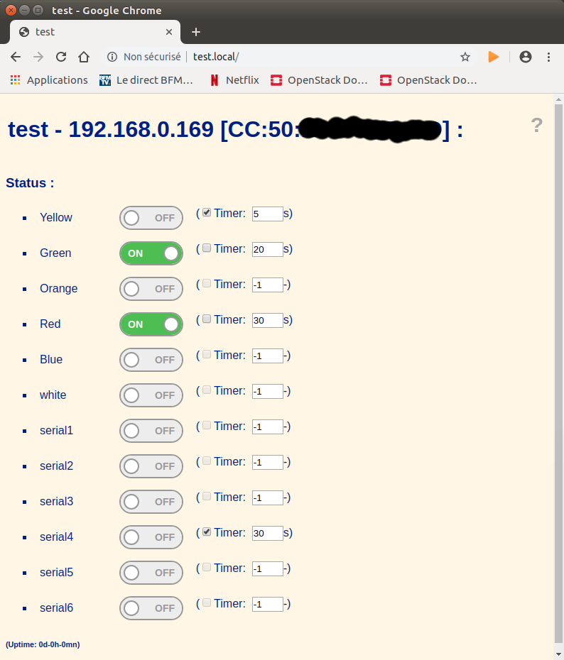

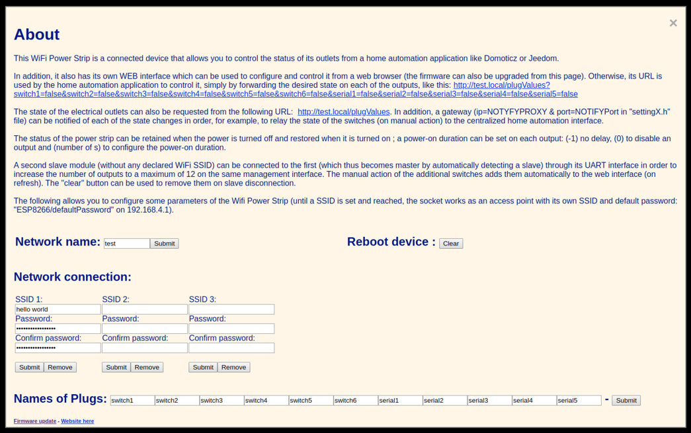

MQTT parameters:

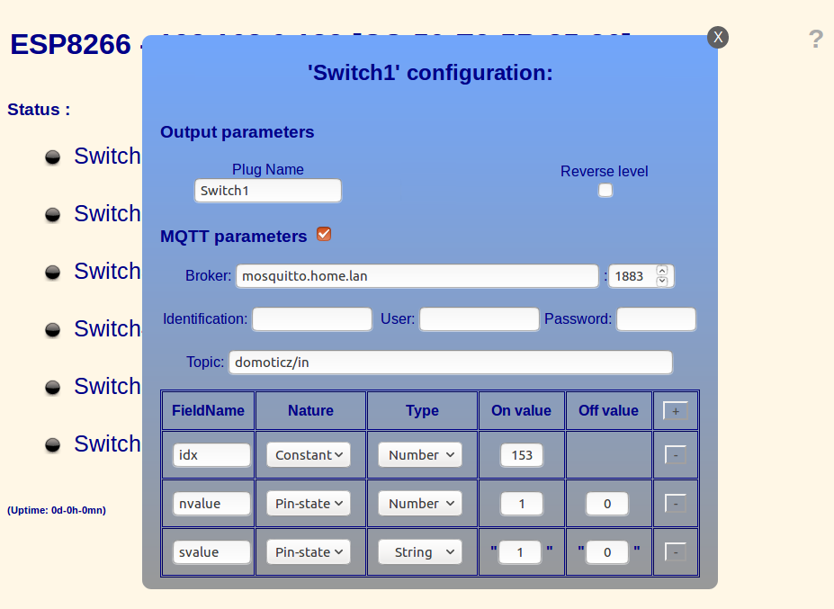

Hardware:
---------

* Webmos D1 mini + wiring diagram of the interfaces (with 2N7002 or S8050):
* 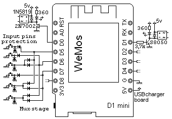
* Progammable contactors with WiFi control: 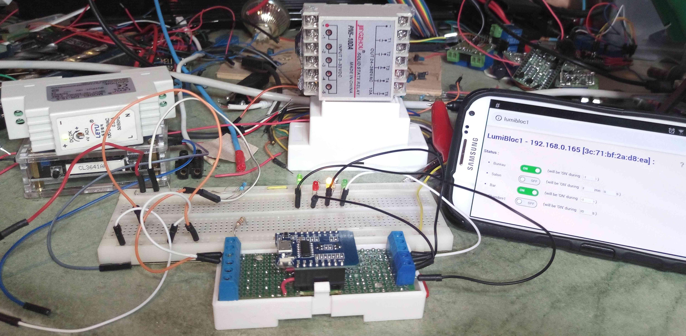 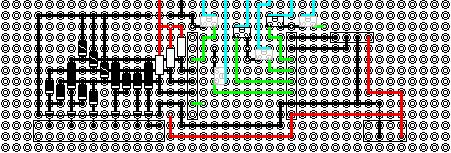
* Interface board: 1 x Wemos mini D1, 21 x 1N5819, 6 x MOSFET 2N7002 SOT23 for a master / slave module (via UART) with 6 switch inputs and 6 outputs for 5v relays.
* 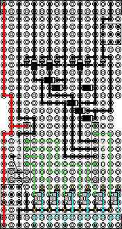
* With 3D printed case: 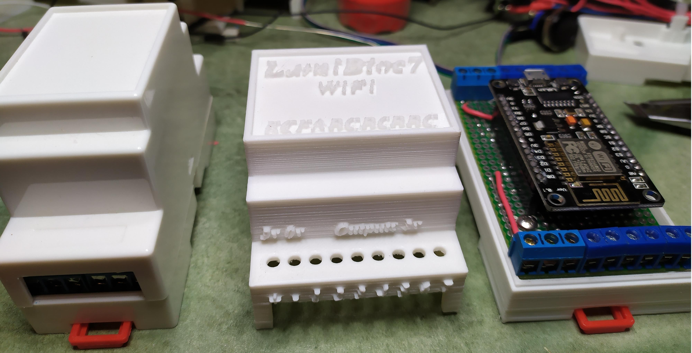
* Master/Slave modules: 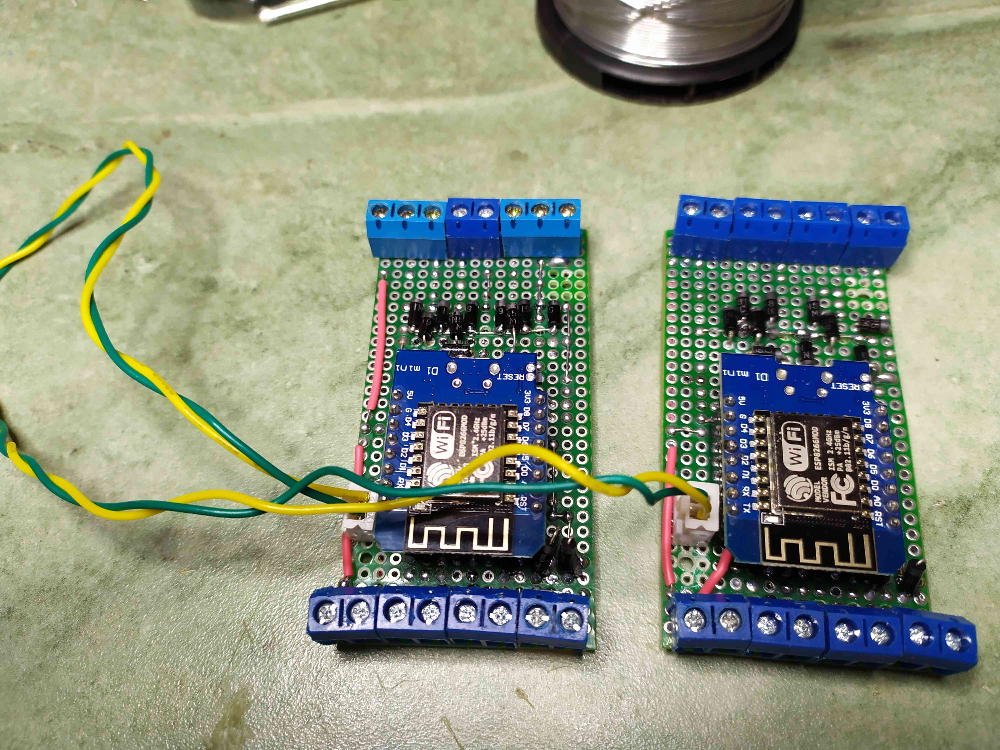
* switchboard (5-way module for lighting control): 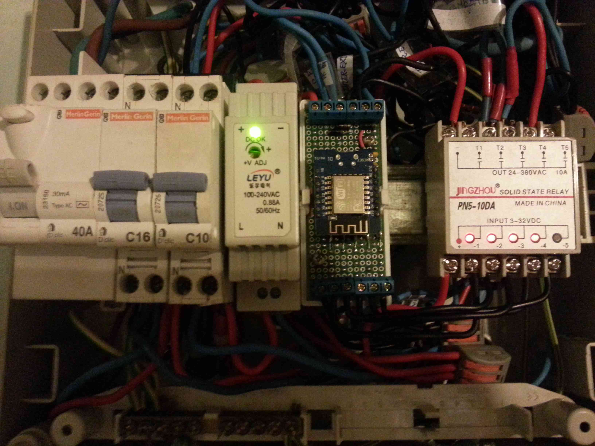
* Example of selector definition in Domoticz: 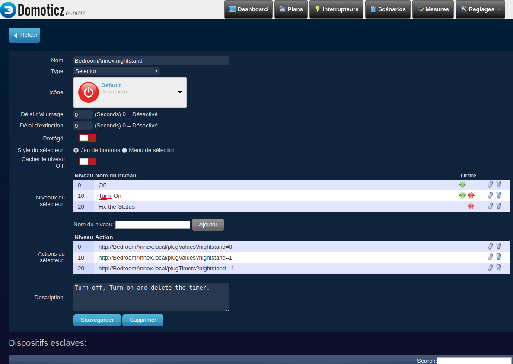
* Plan view ("Fixe-the-State" to inhibit the internal timer, such a 3-second press on switch):
* 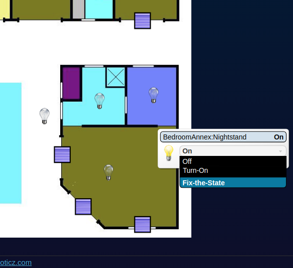
* 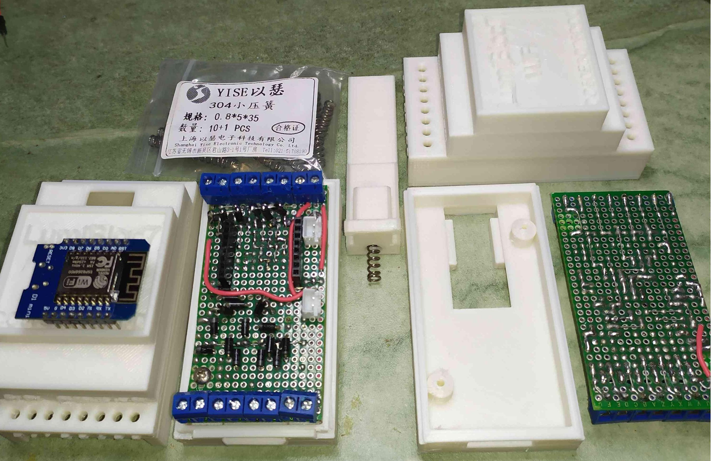

* relay modules (Master/Slave):
* 
