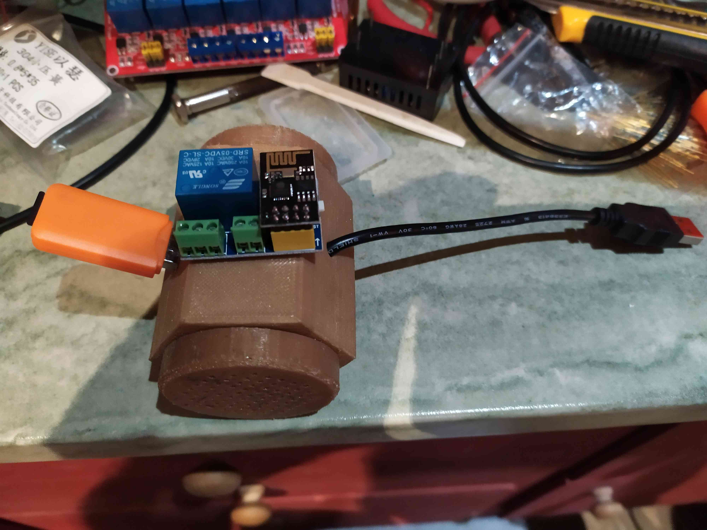
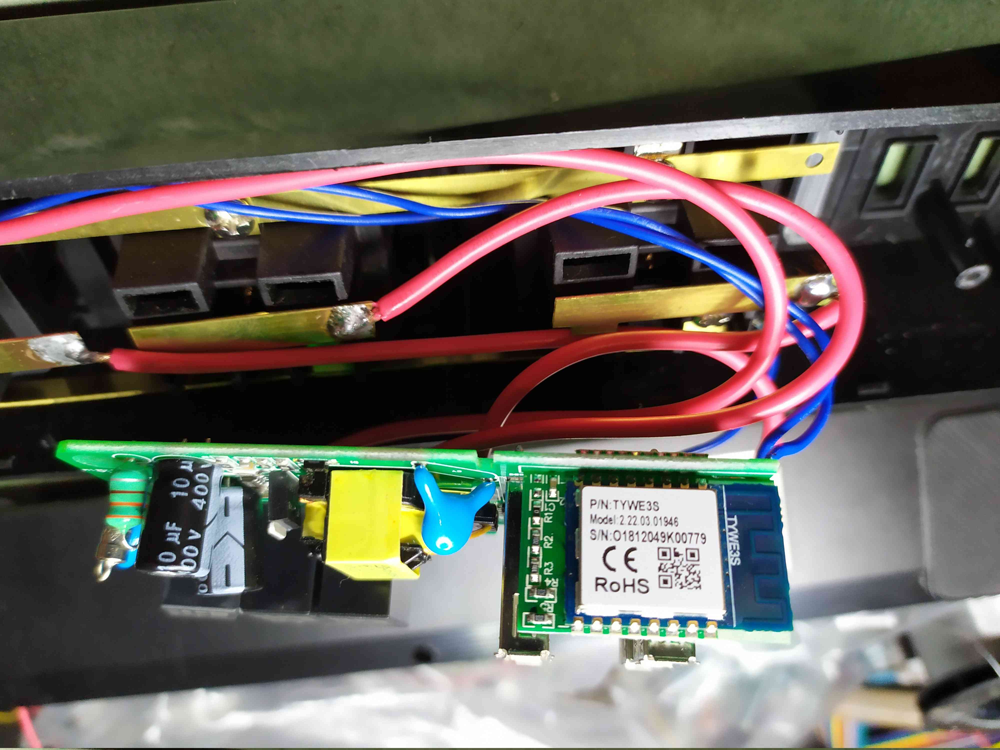
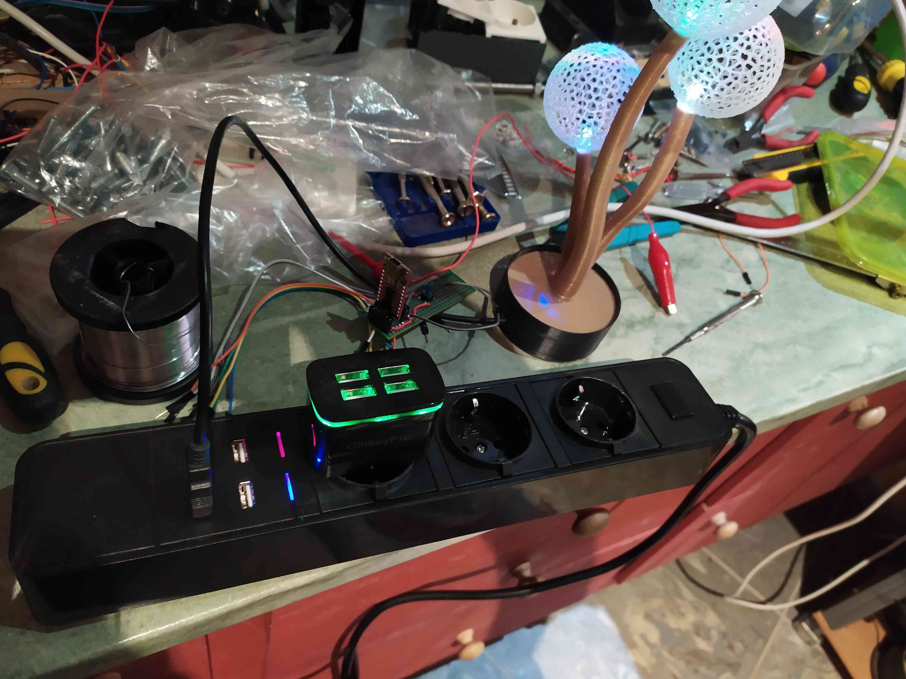

Wifi Power Strip
================

Software:
---------

C++ source, HTML, Javascript & JSON format.

* Allows to control up to 6 switches per ESP8266 module,
* Also allows controlling multiple outputs with a single defined input,
* Can control up to 12 switches with an additional slave module connected via the serial port,
* allows timers on each output,
* temporary cancellation of each timer by holding a few (cf setting.h) seconds its switch,
* return status via MQTT protocol
* 3 configurable SSID,
* configurable reversibility on each output,
* dedug trace available by telnet console,
* web interface configuration,
* available storage of the status of the outputs on reboot,
* firmware update via WiFi, without loss of setting,
* can control contact sensors (via the definition of virtual outputs).
* accepts HTML commands from the home automation software: switching on / off outputs, get status, current timers edition, ...

Http requests available:
<table>
  <tr>
    <td><tt>http://IPAddress</tt></td>
    <td>WEB User Interface</td>
  </tr>
  <tr>
    <td><tt>http://IPAddress/plugNames</tt></td>
    <td>set/get output names</td>
  </tr>
  <tr>
    <td><tt>http://IPAddress/plugTimers</tt></td>
    <td>get/set timers values</td>
  </tr>
  <tr>
    <td><tt>http://IPAddress/plugValues</tt></td>
    <td>get/set outputs</td>
  </tr>
  <tr>
    <td><tt>http://IPAddress/restart</tt></td>
    <td>save status and reboot the device</td>
  </tr>
</table>

Screenshots:

MQTT parameters:

Hardware:
---------

* Webmos D1 mini + wiring diagram of the interfaces (with 2N7002 or S8050):
* 
* Progammable contactors with WiFi control:  
* Interface board: 1 x Wemos mini D1, 15 x 1N5819, 3 x Zeners 3.3v, 6 resistors 360 ohms, 6 x MOSFET 2N7002 SOT23 and somes connectors... for each master / slave module (via UART) of 6 inputs and 6 outputs for power interface control (and SSR relay interface or, best to turn off led lights: 5V relay module board, 6 channels).
* 
* With 3D printed case: 
* Master/Slave modules: 
* switchboard (5-way module for lighting control): 
* Example of selector definition in Domoticz: 
* Plan view ("Fixe-the-State" to inhibit the internal timer, such a 3-second press on switch):
* 
* 

* relay modules (Serial Master/Slave):
* 

* USB WiFi-relay (same code with ESP01-1m):
* 

* Hacking - same code on TUYA power strip (TYWE3S):
* 
* 
