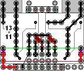

Wifi Power Strip
================

Software:
---------

C++ source

Screenshots:
 

Hardware:
---------

* Webmos D1 mini + wiring diagram of the interfaces:
 
* stackable relay modules:
  
* WiFi Power Strip:
 

* Progammable contactors with WiFi:
 
* interface board:
* 1 x Wemos mini D1, 4 x 1N5819, 5 x MOSFET 2N7002 SOT23,
*  
* switchboard:
 

