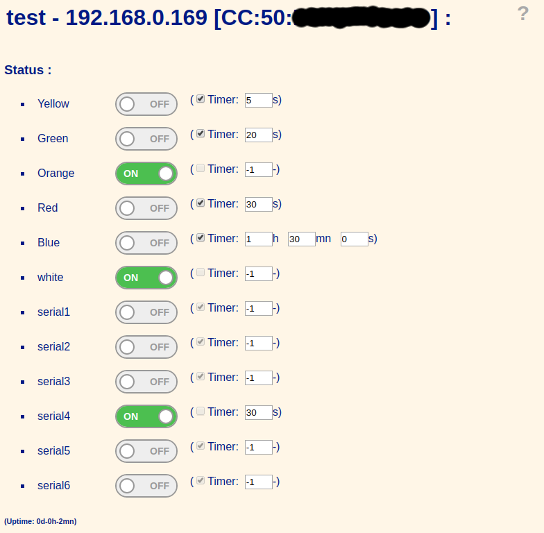
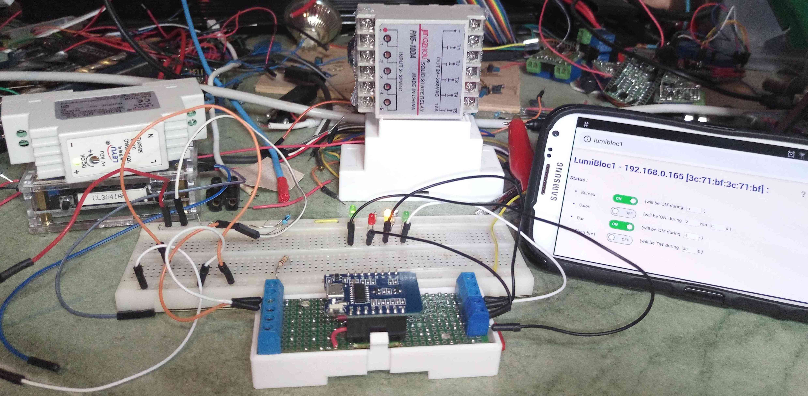

Wifi Power Strip
================

Software:
---------

C++ source

Screenshots:  

Hardware:
---------

* Webmos D1 mini + wiring diagram of the interfaces:
 
* stackable relay modules:
  
* WiFi Power Strip:
 
* Progammable contactors:
 
* interface board:
 
 1 x Wemos mini D1,
 4 x 1N5819,
 5 x MOSFET 2N7002 SOT23,
 5 x 1MOhms (0805 SMD 1/4W) gate-source.

