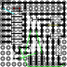

Wifi Power Strip
================

Software:
---------

C++ source

Screenshots:  

Hardware:
---------

* Webmos D1 mini + wiring diagram of the interfaces, 
* interface board, 
* stackable relay modules  

